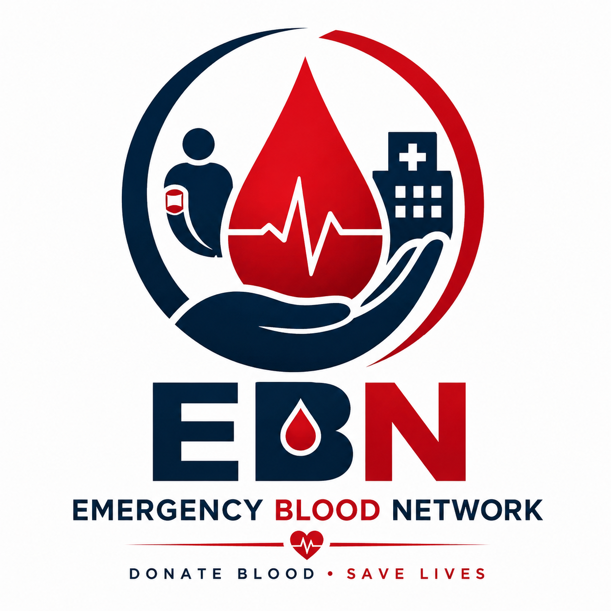
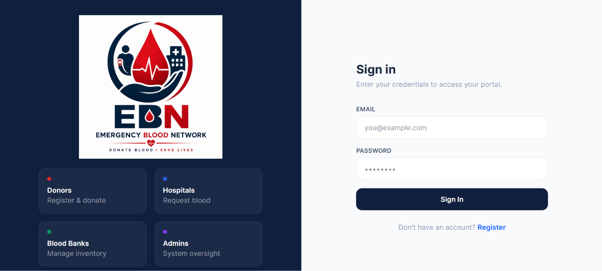
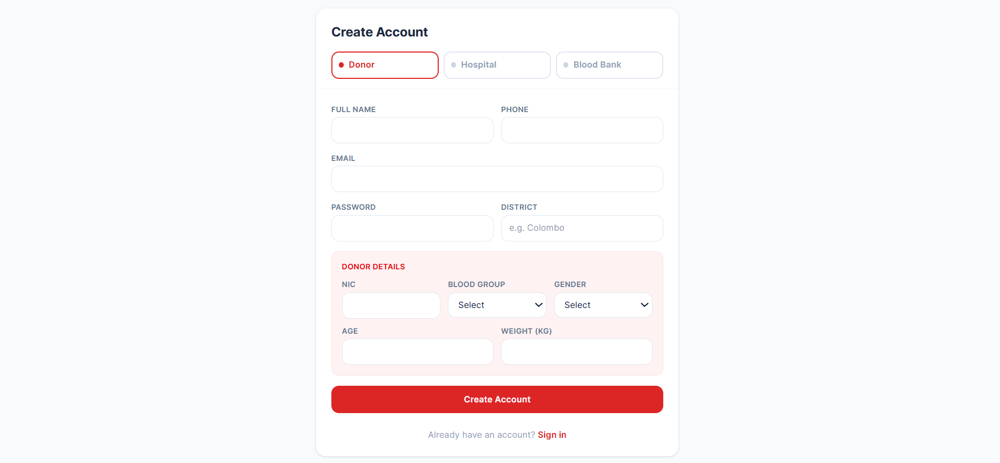
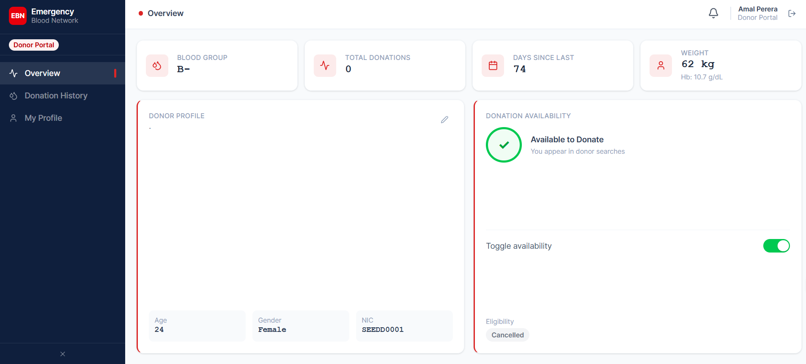
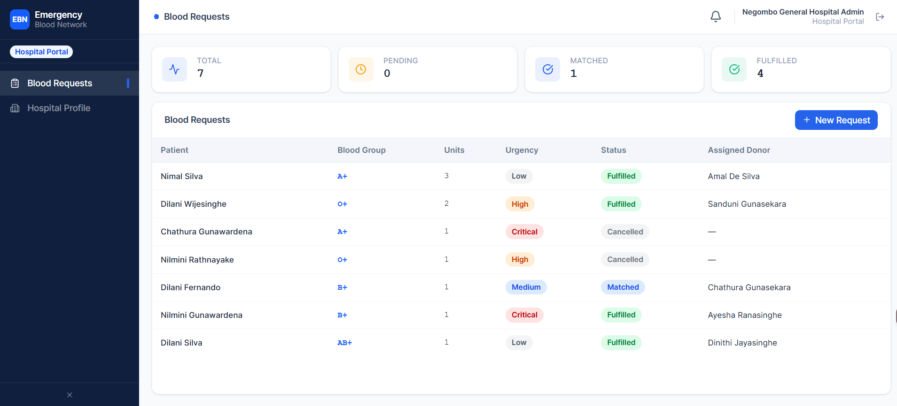
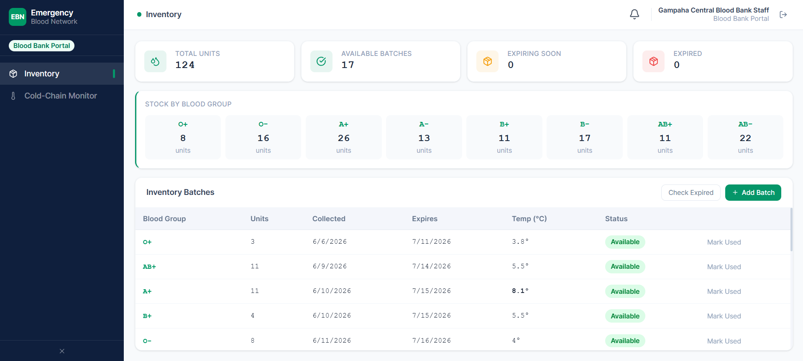
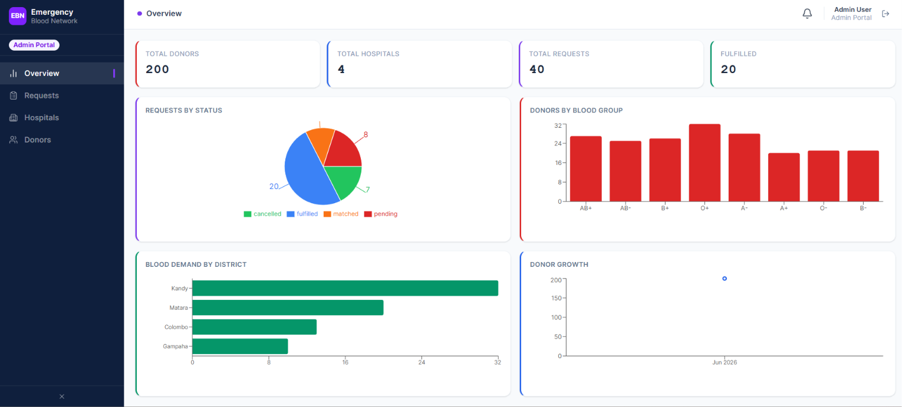

# 🩸 Emergency Blood Network (EBN)

> A real-time blood donation, hospital request, and AI-powered donor matching system that connects donors, hospitals, and blood banks efficiently.

---



---

# 📸 Screenshots

## Home / Sign-In Page


## Register Page


## Donor Dashboard


## Hospital Dashboard


## Blood Bank Dashboard


## Admin Dashboard


---

# 🚀 Overview

Emergency Blood Network (EBN) is a full-stack web application designed to streamline blood donation and emergency blood request management. The platform connects donors, hospitals, blood banks, and administrators through a centralized system while leveraging Artificial Intelligence to improve donor eligibility prediction and donor matching.

The system enables:

- Connect blood donors, hospitals, and blood banks
- Manage real-time blood requests
- Monitor blood inventory
- Predict donor eligibility using Machine Learning
- Match suitable donors using AI
- Manage users through role-based access
- Provide notifications and analytics

---

# 🧠 Key Features

## 👤 User Roles

- Donor
- Hospital
- Blood Bank
- Admin

---

## 🩸 Donor Features

- Register & Login
- Profile Management
- Donation History
- AI-based Eligibility Prediction
- Availability Toggle
- View Notifications

---

## 🏥 Hospital Features

- Create Blood Requests
- Track Request Status
- AI-powered Donor Matching
- View Available Donors

---

## 🏢 Blood Bank Features

- Manage Blood Inventory
- Update Blood Stock
- Track Blood Expiry
- Temperature Monitoring

---

## 🧑‍💼 Admin Features

- Manage Users
- Manage Blood Requests
- View Dashboard Analytics
- Monitor System Activity

---

# 🤖 Artificial Intelligence & Machine Learning

## Donor Eligibility Prediction

Predicts whether a donor is eligible based on:

- Age
- Weight
- Hemoglobin Level
- Previous Donation History

---

## Intelligent Donor Matching

Ranks potential donors using:

- Blood Group Compatibility
- Donor Availability
- Health Status
- Location (Optional)

---

# 🧱 Technology Stack

## Frontend

- React (Vite)
- Tailwind CSS
- Axios
- Context API

---

## Backend

- Node.js
- Express.js
- MongoDB
- Mongoose
- JWT Authentication

---

## AI Service

- Python
- Flask
- Scikit-learn
- Pandas
- NumPy

---

## DevOps

- Docker
- GitHub Actions
- AWS EC2
- Nginx
- PM2
- MongoDB Atlas

---

# 🏗️ System Architecture

```text
                 User Browser
                       │
                       ▼
              Nginx Reverse Proxy
                       │
        ┌──────────────┴──────────────┐
        ▼                             ▼
 React Frontend                 Express Backend
                                      │
                     ┌────────────────┴──────────────┐
                     ▼                               ▼
             MongoDB Atlas                  Flask AI Service
```

---

# 🌐 Production Deployment

The application is fully deployed in a production environment.

### Production Setup

- React frontend served using **Nginx**
- Node.js backend managed by **PM2**
- MongoDB Atlas cloud database
- Flask AI service running independently
- Hosted on an AWS EC2 Ubuntu Server

---

# ⚙️ Server Architecture

```text
Internet
     │
     ▼
AWS EC2 Ubuntu Server
     │
     ▼
Nginx Reverse Proxy (Port 80)
     │
     ▼
React Frontend (Build Files)
     │
     ▼
Express Backend (Port 5000)
     │
     ├──────────────► MongoDB Atlas
     │
     └──────────────► Flask AI Service (Port 8000)
```

---

# 🔐 Environment Variables

Example `.env`

```env
PORT=5000
MONGO_URI=mongodb+srv://<username>:<password>@cluster.mongodb.net/emergency-blood-network
JWT_SECRET=your_secure_secret
JWT_EXPIRES_IN=7d
NODE_ENV=production
AI_SERVICE_URL=http://localhost:8000
```

---

# ☁️ AWS Deployment

The project is deployed on an **AWS EC2 Ubuntu Instance**.

Deployment components include:

- Ubuntu Server
- Nginx Reverse Proxy
- PM2 Process Manager
- MongoDB Atlas
- Docker Support
- GitHub Actions CI/CD

---

### Security Group Configuration

| Port | Purpose |
|------|----------|
| 22 | SSH |
| 80 | HTTP |
| 443 | HTTPS |
| 5000 | Backend API (optional during development) |
| 8000 | Flask AI Service (internal if applicable) |

---

# 📦 CI/CD

GitHub Actions automates the deployment workflow.

### CI/CD Pipeline

- Checkout repository
- Install dependencies
- Build frontend
- Deploy latest code to AWS EC2
- Restart backend using PM2
- Verify deployment

---

# 🧪 Production Testing

Successfully tested:

- ✅ User Registration
- ✅ Login Authentication
- ✅ JWT Authorization
- ✅ Donor Dashboard
- ✅ Hospital Dashboard
- ✅ Blood Bank Dashboard
- ✅ Admin Dashboard
- ✅ Blood Request Creation
- ✅ AI Donor Matching
- ✅ Donor Eligibility Prediction
- ✅ MongoDB Atlas Connectivity
- ✅ API Integration
- ✅ Frontend Deployment

---

# 🎯 Project Status

✅ Production Ready

Completed:

- Cloud Deployment
- MongoDB Atlas Integration
- AI Microservice Integration
- Secure Authentication
- Role-based Authorization
- Docker Support
- GitHub Actions CI/CD
- AWS Deployment

---

# 📈 Future Improvements

- Mobile Application (React Native)
- Firebase Push Notifications
- Live GPS Donor Tracking
- Real-time Chat
- SMS Notifications
- Advanced Analytics Dashboard
- AI Emergency Demand Prediction

---

# 👨‍💻 Authors / Collaborators

- **Sithumini Anuhansi**
- **Pabasara Ranasinghe**
- **Binusha Fernando**
- **Sadeepa Oshadi**

**Software Engineering Undergraduates**

**NIBM Sri Lanka**

---

# 📌 License

This project is developed for academic and demonstration purposes.

---

<div align="right">
  
</div>
